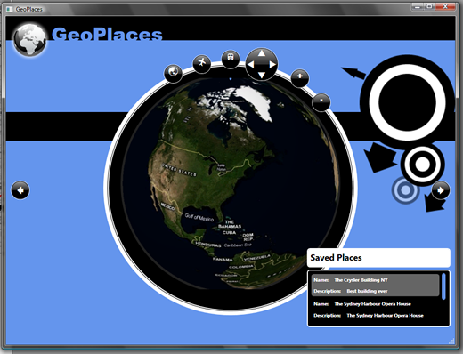
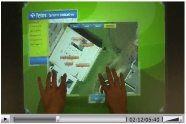
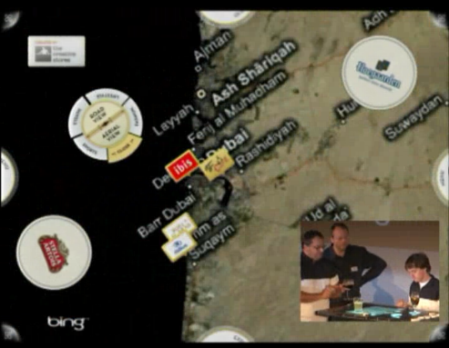
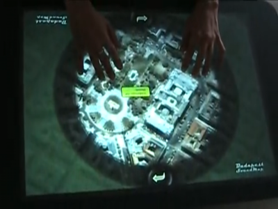

| [Home](Home) | [Getting Started](Getting-Started) | [Features and RoadMap](Features-and-RoadMap) | [Project Structure](Project-Structure) | [Screenshots and Video](Screenshots-and-Video) | [Application list](Application-list) |
# Application List

This page lists all known applications that use the InfoStrat.VE project.  If you are using it and could like to be listed, please let us know!  Tell us the project name, who gets credit (company name/individual), whether it is WPF or Surface, and a screenshot or video.

* Applications
	* [InfoStrat](http://infostrat.com/home/solutions/Surface/SurfaceSVP.htm) Surface apps: (Follow link for videos)
		* Constituent Services
		* Mission Insight
		* Cartography
		* GIS Explorer
		* Weather Mapper
	* [GeoPlaces](http://www.codeproject.com/KB/smart/GeoPlaces.aspx) by Sacha Barber:

	* [SE7EN: Green Initiative](http://www.telos.com/solutions/secure%20networks/se7en/green/) by Telos

	* [Belgian Beef Cafe](http://www.microsoft.com/belux/msdn/nl/chopsticks/default.aspx?id=1404) by the creative stores. Featured at ReMix 2009! (Skip to 10:30 in the video)

	* [Budapest Soundmap](http://cine.hu/surface/) by Liszka Tamás and Bart Dániel

	* ...Your name here!