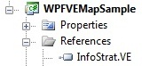
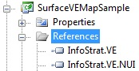

| [Home](Home) | [Getting Started](Getting-Started) | [Features and RoadMap](Features-and-RoadMap) | [Project Structure](Project-Structure) | [Screenshots and Video](Screenshots-and-Video) | [Application list](Application-list) |
# Getting Started
## Requirements
To compile and run this project, you need to have the following installed:
* [.NET Framework 3.5 SP1](http://www.microsoft.com/downloads/details.aspx?FamilyID=AB99342F-5D1A-413D-8319-81DA479AB0D7&displaylang=en)
* [Bing Maps 3D](http://www.microsoft.com/Downloads/details.aspx?FamilyID=e9298080-50c4-4f2e-9fc4-4009074996ba&displaylang=en) (7/9/2009 or later)
	* If you have visited [http://maps.bing.com](http://maps.bing.com) and clicked the 3D button recently, then you are already updated

For the SurfaceVEMap, you'll need either a Microsoft Surface device or the Microsoft Surface SDK Workstation Edition, including the simulator.

The source code project files are for Visual Studio 2008.
## Download
Visit the Releases tab above and download the binaries.
## Add References
Create or open your WPF project in Visual Studio and add a reference to InfoStrat.VE.dll for WPF apps:

Add both InfoStrat.VE.dll and InfoStrat.VE.NUI.dll for Surface apps:

For Windows 7 Touch apps, add InfoStrat.VE.dll, Infostrat.VE.Windows7Touch.dll, Wnidows7.Multitouch.dll, and Windows7.Multitouch.WPF.dll.
## Add VEMap
Add the namespace reference:

{"<xmlns:ve="clr-namespace:InfoStrat.VE;assembly=InfoStrat.VE">"}

Then add a VEMap (or SurfaceVEMap) control to your XAML.  (Alternately instantiate it in code and add it to the UI tree manually.)  

{"<ve:VEMap />"}
## Run!
Now you are good to go! Try adding VEPushPin objects as children to the VEMAP and set the Latitude and Longitude properties of VEPushPin.