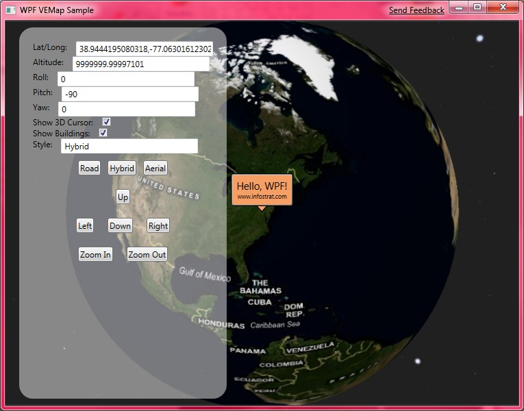

| [Home](Home) | [Getting Started](Getting-Started) | [Features and RoadMap](Features-and-RoadMap) | [Project Structure](Project-Structure) | [Screenshots and Video](Screenshots-and-Video) | [Application list](Application-list) |
# **Screenshots and Video**
WPF Sample Application:

Example application using InfoStrat.VE:
{video:url=http://www.youtube.com/watch?v=rB2KnQeBlKI,type=youtube,align=left}
Check out the [InfoStrat Surface Gallery](http://www.InfoStrat.com/home/solutions/Surface/SurfaceSVP.htm) for more examples of this control in Microsoft Surface applications.
_Note: InfoStrat.VE does not include the ring menu shown in the video above._